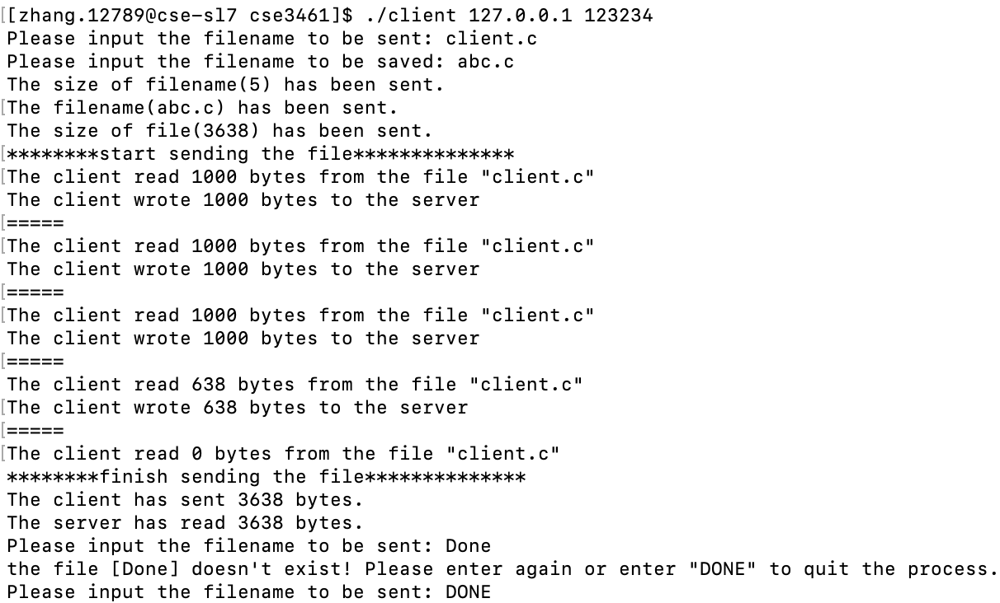
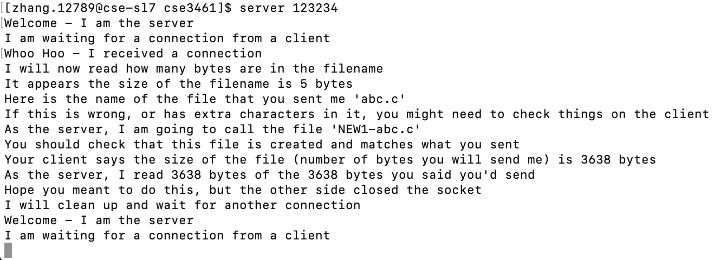

# File Transfer Tool
This is a simple file transfer tool by using TCP STREAM sockets, which enables the client to send any file to server.

## Environment
It is only ensured that all the files would be compiled and ran on the Ohio State University linux system(CSEGRID). 

## Setup
- server
  1. put the executable file "server" somewhere in the server machine
  2. run command `chmod a+x server`
  3. run command `server <port-number>`
- client
  1. put both the client.c file and makefile in the same folder of client machine
  2. run command `make`
  3. run command `./client <server-ip> <port-number>`
  4.(optional) run command `make clean` to delete the executable file "client"

## Client Workflow
The client will loop, asking the user for the name of a file to transfer to the server and the its name when being saved. With each filename, the client will
- Send the size of the name of the file to be saved (use htonl()  function to convert the number)
- Send the name of the file to be saved
- Send the filesize to the server (files will be less than 1GB in size) (use htonl()) 
- Send all the bytes (less than 1000 bytes at a time) to the server 
- Wait for the server to send back how many files it actually received (encoded using htonl()).
- Print the number of bytes sent and the number of bytes that server received before asking for the next file name.
When the file name “DONE” is entered, the client will exit the loop and close the socket.    
