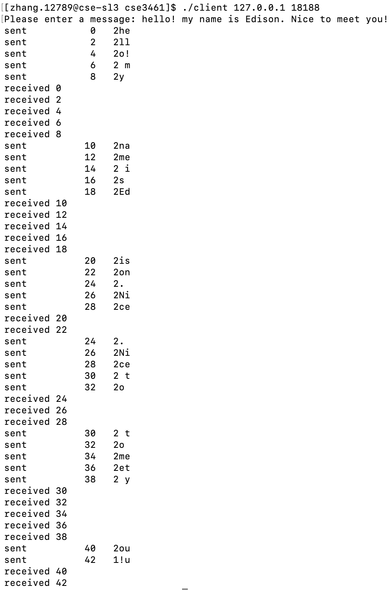
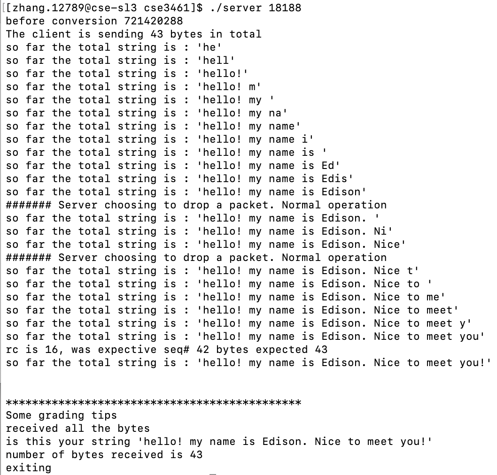

# File Transfer Tool
This is a simple message tool utilizing RDT and sliding window protocol based on UDP datagram, which enables users to send a string from client to server.
- client interface

- server interface

## Environment
It is only ensured that all the files would be compiled and ran on the Ohio State University linux system(CSEGRID). 

## Setup
- server
  1. put the executable file "server" somewhere in the server machine
  2. run command `chmod a+x server`
  3. run command `server <port-number>`
- client
  1. put both the client.c file and makefile in the same folder of client machine
  2. run command `make`
  3. run command `./client <server-ip> <port-number>`
  4.(optional) run command `make clean` to delete the executable file "client"

## Client Workflow
1. Ask users for the message they want to send to server
2. Send server 4 bytes size of the message that is going to be sent(use htonl to encode) [ASSUME IT GETS TO THE SERVER]
3. Send server a WINDOW of messages(WINDOW_SIZE = 10)  
  each message is in a 17 byte string/buffer with:
  - the seq number in an 11 char field
  - a 4 byte field with the size
  - 2 bytes of the string(always send 2 bytes, except the last time if the string length is odd, the client will send 1 byte)
4. Wait for ACKs from the Server, and Slide the window accordingly until all the messages have been sent
